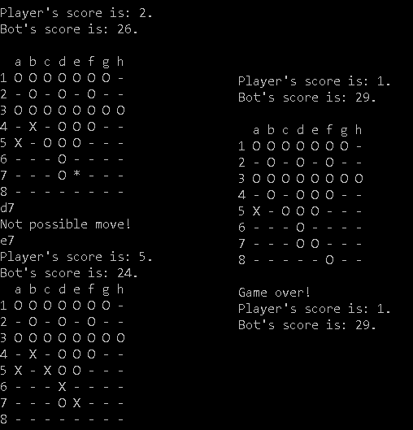
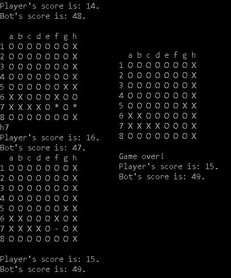
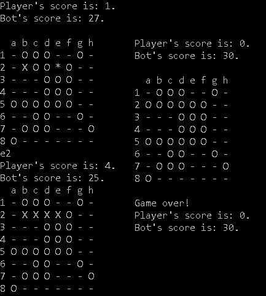
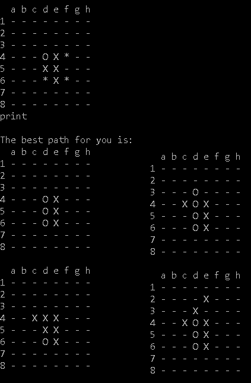

# An Othello game with visualization via command line and with a game bot
School assignment n. 9 from course Application programming in C++ in third bachelor semester.

## Usage
```bash
othello.exe <disk color> <reaction time> <max depth> <heuristics>
```
You can choose one out of the three options:  
`<disk color>`  : --white or --black   
`<reaction time>` : reaction time for algorithm (optional)  
`<max depth>` :   max depth for algorithm (optional)  
`<heuristics>` :  heuristic function for algorithm; 1 is for material count and 2 is for checking corners and finding stable disk (optional) 

## Controls  
To place a disk simply enter letter of a collumn and number of a row, e.g `d3`.  
To stop just type `stop`.  
To see the best possible path of choice just enter `print`.

<p align="center">
	
	
	
	
</p>
